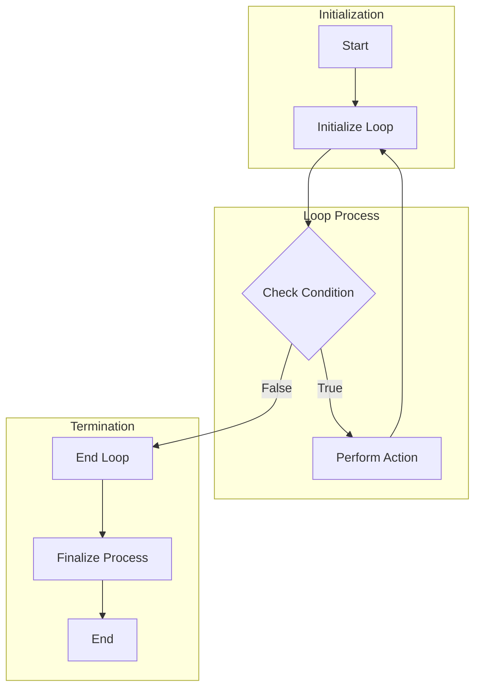

# Loop and Termination Flow

A Loop and Termination Flow is used to depict processes that involve repetitive actions and conditional terminations. It is ideal for illustrating cycles or iterations in a process, and how they conclude based on specific conditions.

## Flow

