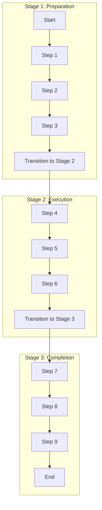

# Multi-Stage Process Flow

A Multi-Stage Process Flow is used to represent complex processes that are divided into distinct stages. Each stage consists of a series of steps or actions, and the transition between stages is often based on specific criteria or outcomes.

## Flow

