# Sequential Steps Flow

A Sequential Steps Flow is designed to represent processes that follow a linear progression. Each step in the process leads directly to the next, making it straightforward to understand the sequence of actions or events.

## Flow

```mermaid
graph LR
    A[Start] --> B[Step 1]
    B --> C[Step 2]
    C --> D[Step 3]
    D --> E[Step 4]
    E --> F[Step 5]
    F --> G[Step 6]
    G --> H[Step 7]
    H --> I[Step 8]
    I --> J[Step 9]
    J --> K[Step 10]
    K --> L[Step 11]
    L --> M[Step 12]
    M --> N[Step 13]
    N --> O[Step 14]
    O --> P[Step 15]
    P --> Q[Step 16]
    Q --> R[Step 17]
    R --> S[Step 18]
    S --> T[Step 19]
    T --> U[Step 20]
    U --> V[Step 21]
    V --> W[Step 22]
    W --> X[Step 23]
    X --> Y[Step 24]
    Y --> Z[Step 25]
    Z --> ZA[End]
```

