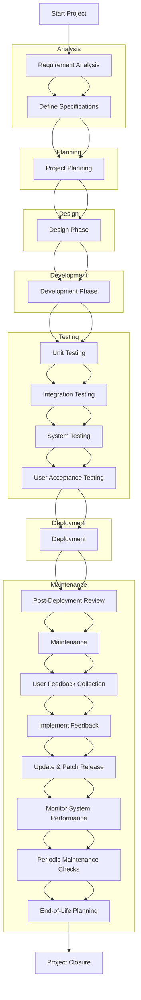

# Software Development Lifecycle

## Description
This flowchart outlines the comprehensive process of a typical software development lifecycle (SDLC), from initial planning to deployment and maintenance.

## Mermaid Flowchart

