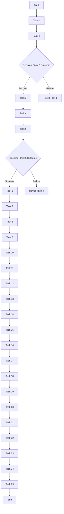

# Task Flow

A Task Flow is designed to illustrate the sequence and interdependencies of tasks within a project or process. It helps in understanding how tasks are organized, their order of execution, and how they contribute to the overall process or objective.

## Flow

