# Basic Process Flow with Subgraphs

A Basic Process Flow with Subgraphs represents a straightforward sequence of steps in a process, enhanced with the use of subgraphs to denote grouped stages or categories within the process. This adds an extra layer of organization and clarity, especially for larger flows.

## Flow

```mermaid
graph LR
    subgraph SG1 [Stage 1]
        A[Start] --> B[Step 1]
        B --> C[Step 2]
        C --> D[Step 3]
    end
    subgraph SG2 [Stage 2]
        D --> E[Step 4]
        E --> F[Step 5]
        F --> G[Step 6]
    end
    subgraph SG3 [Stage 3]
        G --> H[Step 7]
        H --> I[Step 8]
        I --> J[Step 9]
    end
    subgraph SG4 [Stage 4]
        J --> K[Step 10]
        K --> L[Step 11]
        L --> M[Step 12]
    end
    subgraph SG5 [Stage 5]
        M --> N[Step 13]
        N --> O[Step 14]
        O --> P[Step 15]
    end
    subgraph SG6 [Final Stage]
        P --> Q[Step 16]
        Q --> R[Step 17]
        R --> S[Step 18]
        S --> T[Step 19]
        T --> U[Step 20]
        U --> V[End]
    end
```

