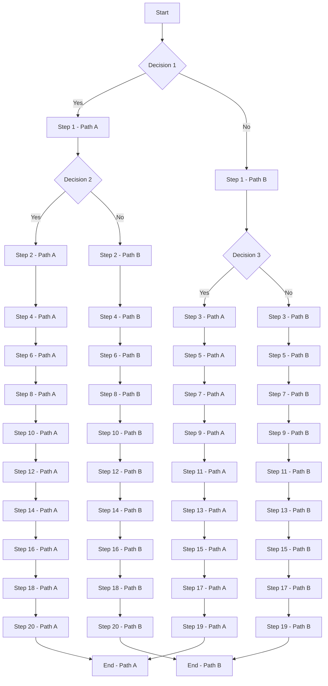

# Conditional Flow

A Conditional Flow illustrates a process that involves decision-making steps leading to different outcomes or paths. It is particularly useful for mapping out processes where the next step depends on the result of a previous action.

## Flow

