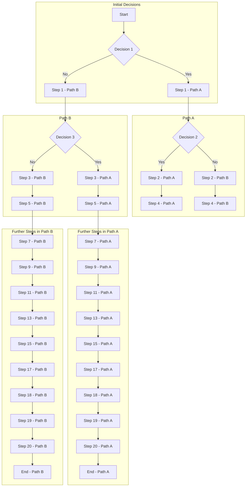

# Conditional Flow with Subgraphs

A Conditional Flow with Subgraphs adds a layer of organization to a process involving decision-making steps and multiple paths. Subgraphs can help categorize different sections or types of decisions within the flow, making it easier to follow and understand.

## Flow

