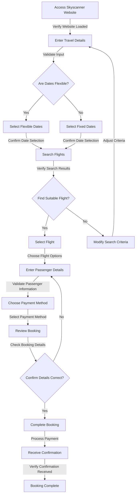

## Skyscanner booking flow

```mermaid
    flowchart TD
        A[Access Skyscanner Website] -->|Verify Website Loaded| B[Enter Travel Details]
        B -->|Validate Input| C{Are Dates Flexible?}
        C -->|Yes| D[Select Flexible Dates]
        C -->|No| E[Select Fixed Dates]
        D -->|Confirm Date Selection| F[Search Flights]
        E -->|Confirm Date Selection| F
        F -->|Verify Search Results| G{Find Suitable Flight?}
        G -->|Yes| H[Select Flight]
        G -->|No| I[Modify Search Criteria]
        I -->|Adjust Criteria| B
        H -->|Choose Flight Options| J[Enter Passenger Details]
        J -->|Validate Passenger Information| K[Choose Payment Method]
        K -->|Select Payment Method| L[Review Booking]
        L -->|Check Booking Details| M{Confirm Details Correct?}
        M -->|Yes| N[Complete Booking]
        M -->|No| J
        N -->|Process Payment| O[Receive Confirmation]
        O -->|Verify Confirmation Received| P[Booking Complete]
```